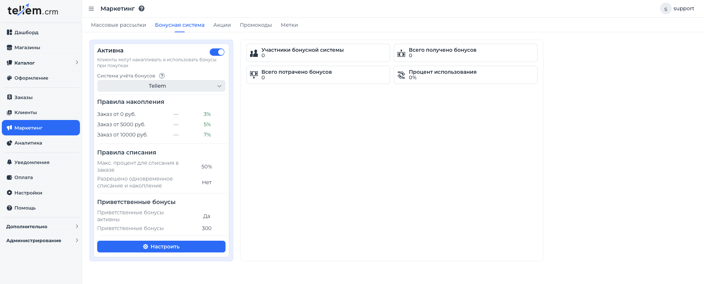
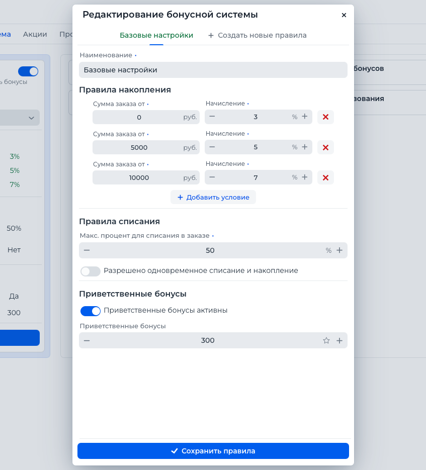
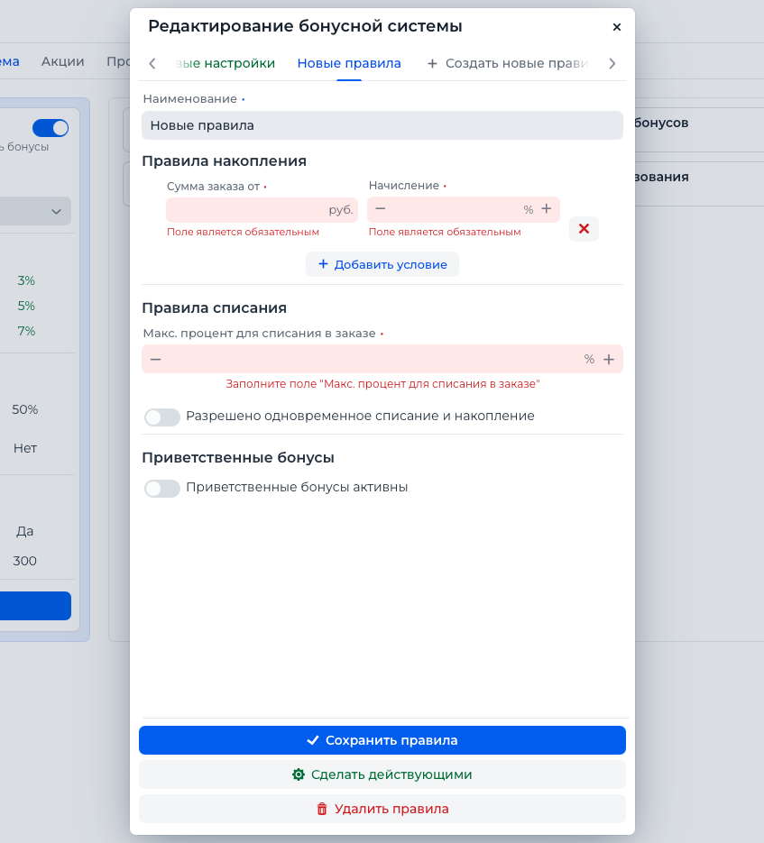
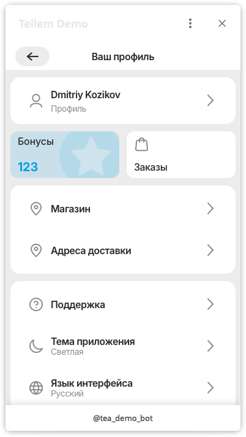
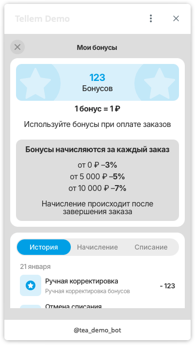

# Активация бонусной системы для клиентов

Инструкция описывает процесс активации и настройки бонусной системы в ЦРМ. с двумя экранами:

- «Бонусная система» — основной экран управления.
- «Редактирование бонусной системы» — детальная настройка правил.

## 1. Экран «Бонусная система»

Экран доступен на вкладке пункта меню "Маркетинг".
Здесь включается/выключается бонусная система, выбирается активный провайдер, просматриваются активные правила и
аналитика по использованию клиентами.

**Основные элементы:**

- Переключатель состояния вверху карточки (включает/выключает бонусную систему).
- Поле «Система учёта бонусов» — выбор активного провайдера. По умолчанию провайдером выступает сама ЦРМ.
  Если есть потребность подключить интеграцию со сторонней бонусной системой — напишите нам.
- Блоки «Правила накопления», «Правила списания», «Приветственные бонусы» — отображение активных правил.
- Кнопка «Настроить» — открывает детальную настройку.

**Как включить и выбрать провайдера:**

1) Включите переключатель состояния вверху экрана.
2) Убедитесь, что в блоке правил отображаются актуальные параметры.
3) При желании, нажмите кнопку "Настроить" и сконфигурируйте собственные правила.

## 2. Экран «Редактирование бонусной системы»

Экран открывается по кнопке «Настроить». Здесь создаются и редактируются наборы правил.

**Структура экрана:**

- Вкладки правил. Есть вкладка «Создать новые правила».
- Поле «Наименование» — название набора правил для Вашего удобства (оно же название вкладки).
- Раздел «Правила накопления» — условия начисления.
- Раздел «Правила списания» — параметры использования бонусов.
- Раздел «Приветственные бонусы» — настройка бонусов за регистрацию.
- Кнопки действий: «Сохранить правила», «Сделать действующими», «Удалить правила».

### 2.1 Создание нового набора правил

1) Нажмите вкладку «Создать новые правила».
2) Заполните «Наименование» — это имя набора.
3) В разделе «Правила накопления» добавьте условия:
    - Нажмите «Добавить условие».
    - Заполните:
        - «Сумма заказа от» — минимальная сумма заказа (>= 0).
        - «Начисление» — процент начисления (от 1 до 99).
    - Можно добавить несколько условий с разными порогами.
4) В разделе «Правила списания» задайте:
    - «Макс. процент для списания в заказе» (от 1 до 99).
    - Переключатель «Разрешено одновременное списание и накопление» — можно ли одновременно тратить и получать бонусы в
      одном заказе.
5) В разделе «Приветственные бонусы»:
    - Включите «Приветственные бонусы активны».
    - Укажите «Приветственные бонусы».
6) Нажмите «Сохранить правила».

### 2.2 Сделать набор правил активным

В некоторых ситуациях удобно иметь несколько наборов правил бонусной системы,
между ними возможно переключаться в один клик.

1) Откройте вкладку нужного набора.
2) Нажмите «Сделать действующими».

> Важно! Активным может быть только один набор правил.

### 2.3 Удаление набора правил

1) Откройте вкладку неактивного набора.
2) Нажмите «Удалить правила».

> Активные правила удалить нельзя — сначала переключите активность на другой набор.

## 3. Проверка после настройки

1) Вернитесь на экран «Бонусная система».
2) Убедитесь, что выбран нужный провайдер и отображаются актуальные правила.
3) Проверьте блок аналитики — данные должны обновиться.

## 4. Экран для покупателей телеграм магазина

Для покупателей доступен свой экран просмотра информации по бонусной системе.
Экран доступен по соответствующей кнопке внутри профиля покупателя телеграм магазина.

**Покупатель может просматривать следующую информацию:**
- Собственный баланс бонусов 
- Текущие правила накопления и списания
- История бонусных операций (транзакций)

