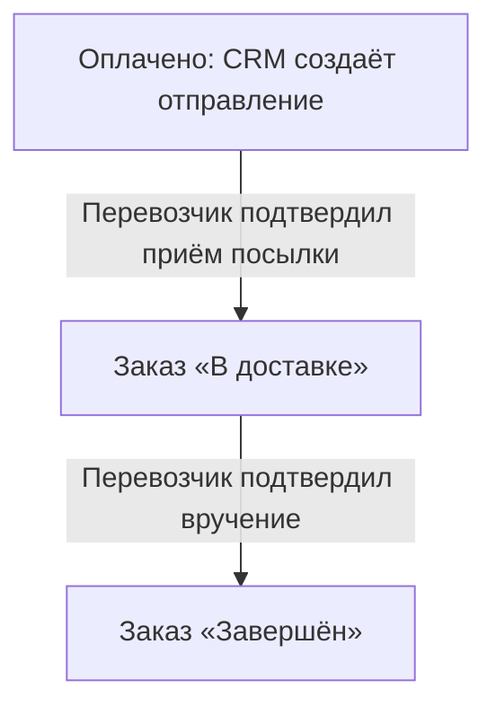

# Доставка и статусы заказов

Для заказов со СДЭК и Яндекс Доставкой CRM создаёт отправление после подтверждения
оплаты и получает статусы у перевозчика. Администратор готовит и передаёт посылку,
а CRM отражает её движение в заказе.

!!! info "Статусы проверяются автоматически раз в час"
    CRM запрашивает состояние активных отправлений в начале каждого часа.
    Когда перевозчик подтверждает приём посылки, заказ переходит **«В доставке»**;
    когда подтверждает вручение покупателю — **«Завершён»**.
    Для более быстрого обновления после сдачи посылки откройте заказ и нажмите
    **«Запросить статус у перевозчика»**. Ждать следующего часа не нужно.

## Какие доставки поддерживаются

| Способ получения | Что делает CRM |
|---|---|
| СДЭК | Создаёт предоплаченное отправление после оплаты, проверяет статусы, обновляет заказ |
| Яндекс Доставка «По России», в ПВЗ | Создаёт предоплаченное отправление после оплаты, проверяет статусы, обновляет заказ |
| Ozon | Выбор ПВЗ и расчёт стоимости; отправление оформляется отдельно, автоматические статусы пока не поддерживаются |
| Собственный курьер или самовывоз из магазина | Этапами заказа управляет сотрудник вручную |

Перед первым заказом [подключите перевозчика](stores-and-delivery.md) в
**«Настройки → Доставка»** и включите способ получения в **«Каталог → Магазины»**.
Для Ozon есть [отдельная инструкция](ozon-delivery.md).
Проверка подключения рассчитывает пробную доставку, но не создаёт отправление.

## От оплаты до вручения

Переходы по данным перевозчика происходят при проверке раз в час или по кнопке
в карточке заказа.

1. Покупатель выбирает доставку и пункт выдачи, оформляет и оплачивает заказ.
2. После подтверждения оплаты заказ получает статус **«Оплачено»**. CRM запускает
   создание отправления, не дожидаясь очередной часовой проверки.
3. В карточке появляются результат регистрации и ID отправления у перевозчика.
   Проверьте их перед передачей посылки. При ошибке сначала устраните причину.
4. Подготовьте посылку и передайте её выбранной службе. Само создание накладной
   ещё не означает, что перевозчик принял товар.
5. CRM получает дальнейшие события при автоматической или ручной проверке.

Если покупатель платит переводом, дождитесь поступления денег и нажмите
**«Подтвердить получение оплаты»** в заказе. Сообщение покупателя «Я оплатил»
само по себе не запускает регистрацию отправления.

!!! note "Оплата покупателя и услуги перевозчика"
    Автоматические отправления создаются с предоплатой, без повторного сбора денег
    с покупателя при получении. Продавец рассчитывается с перевозчиком отдельно
    по условиям своего аккаунта и договора.

## Что видно в карточке заказа

Откройте **«Заказы»**, найдите заказ по номеру и выберите его строку.
Блок **«Информация о доставке»** появляется, когда для заказа есть запись доставки.
В нём отображаются:

- выбранный покупателем пункт выдачи;
- статус отправления, его ID и номер накладной, если перевозчик их уже вернул;
- статус перевозчика, время последней и следующей проверки;
- сообщение об ошибке, если создание или проверка не удались.

Пустые поля скрыты. До регистрации запись может иметь статус **«Не создано»** —
это ещё не отправление в личном кабинете перевозчика.

**Статус заказа и статус отправления — разные поля.** Например, заказ уже оплачен,
а отправление ещё регистрируется:

| Событие | Статус отправления | Что происходит с заказом |
|---|---|---|
| Оплата ещё не подтверждена | Не создано | Отправление пока не создаётся |
| Создание запущено | Ожидает регистрации / Регистрируется | Само создание не переводит заказ в доставку |
| Перевозчик зарегистрировал отправление | Зарегистрировано | Можно готовить передачу посылки; это ещё не приём товара |
| Перевозчик подтвердил приём или перевозку | В доставке | CRM устанавливает «В доставке» |
| Посылка прибыла в ПВЗ | В доставке | CRM ещё не завершает заказ |
| Подтверждено вручение покупателю | Вручено | CRM устанавливает «Завершён» и прекращает опрос |

Если сотрудник уже вручную выставил **«Ожидает получения»**, подтверждение
перевозки не возвращает заказ в **«В доставке»**. Подтверждённое вручение по-прежнему
завершит такой заказ.

## Как обновить статус сразу после отправки

1. После сдачи посылки откройте **«Заказы → нужный заказ»**.
2. В блоке **«Информация о доставке»** нажмите **«Запросить статус у перевозчика»**.
3. Дождитесь сообщения о запуске проверки и подождите несколько секунд.
4. Нажмите **«Обновить данные»**. Проверьте статус отправления, статус заказа и
   поле **«Сообщение»**.

**«Запросить статус у перевозчика»** получает новые сведения у службы доставки.
**«Обновить данные»** только показывает уже полученный результат в карточке CRM.
Если проверка ещё выполняется, повторно запускать её не нужно.

!!! note "Перевозчик тоже должен обновить свои данные"
    Если пункт приёма ещё не зарегистрировал передачу посылки, ручной запрос
    вернёт прежний статус. Подождите обработки у перевозчика и повторите проверку
    позже либо дождитесь автоматического обновления. Свежая «Последняя проверка»
    при сообщении об ошибке не означает, что CRM успешно получила новый статус.

## Примеры работы администратора

### Сценарий 1. Обычная доставка без ручных проверок

Покупатель заказал шлем через СДЭК. Время ниже условное; в примере события уже
доступны в системе перевозчика к моменту проверки.

| Время | Событие | Что увидит администратор |
|---|---|---|
| 10:10 | Оплата подтверждена | Заказ «Оплачено», CRM создаёт отправление |
| 10:35 | Продавец сдал посылку, СДЭК зарегистрировал приём | До следующей проверки в CRM ещё может быть прежний статус |
| 11:00 | Плановая проверка | Заказ переходит «В доставке» |
| На следующий день, 13:25 | Покупатель забрал посылку, СДЭК подтвердил вручение | CRM узнает об этом при следующей проверке |
| 14:00 | Плановая проверка | Заказ «Завершён», отправление «Вручено», опрос прекращён |

### Сценарий 2. Посылку сдали, статус нужен сейчас

В 15:10 продавец передал предоплаченный заказ в пункт приёма Яндекс Доставки.
Следующая плановая проверка — в 16:00. Чтобы обновить заказ раньше:

**«Заказы → нужный заказ → Информация о доставке → Запросить статус у перевозчика»**,
через несколько секунд — **«Обновить данные»**.

Если Яндекс уже подтвердил приём, заказ перейдёт **«В доставке»** сразу по
результату этой проверки. Менять статус заказа вручную для этого не требуется.
Так же можно ускорить обновление после получения посылки покупателем.

### Сценарий 3. Покупатель оплатил, но отправления нет

В заказе указано **«Требует исправления»**, а в сообщении — «Оферта не акцептована».

1. Завершите подключение компании в кабинете Яндекс Доставки по
   [инструкции Яндекса](https://yandex.ru/support/delivery-profile/ru/other-day/how-to-join).
2. Вернитесь в тот же заказ CRM и нажмите **«Повторить после исправления»**.
3. Через несколько секунд нажмите **«Обновить данные»** и проверьте результат и ID.

Если для СДЭК не заполнены имя, телефон или пункт отправления, исправьте
настройку в **«Настройки → Доставка»** и используйте ту же кнопку повтора в заказе.

## Если статус не меняется

| Что видно | Что сделать |
|---|---|
| Не создано, оплата ещё не подтверждена | Проверить оплату; автоматическая регистрация начнётся после её подтверждения |
| Не создано у ранее оформленного оплаченного заказа | Если доступна кнопка «Создать отправление», нажать её и проверить результат |
| Требует исправления | Прочитать сообщение, исправить причину; при доступной кнопке нажать «Повторить после исправления» |
| Результат уточняется | Прочитать сообщение. Если доступна кнопка «Запросить статус у перевозчика», нажать её: CRM ищет возможное уже созданное отправление. Если кнопки нет, дождаться плановой проверки |
| Ошибка связи при проверке | Дождаться восстановления связи и повторить запрос; активные отправления также проверяются по расписанию |
| Посылка в ПВЗ, заказ ещё «В доставке» | Это нормально: для завершения нужно подтверждение вручения покупателю |
| Не вручено или Отменено | Проверить ситуацию в кабинете перевозчика и обработать заказ в CRM; успешное завершение автоматически не выставляется |

Автоматический опрос прекращается после вручения, окончательного невручения,
отмены отправления или состояния **«Требует исправления»**. Также он не продолжается,
если сам заказ уже завершён, отменён, возвращён или завершился ошибкой оплаты.

Отмена заказа в CRM не отменяет отправление у перевозчика. Отмену накладной,
ярлыки и организацию забора оформляйте в кабинете службы доставки.

Связанные инструкции: [настройка доставки](stores-and-delivery.md),
[работа с заказами](orders.md), [путь покупателя](../app/checkout.md).
