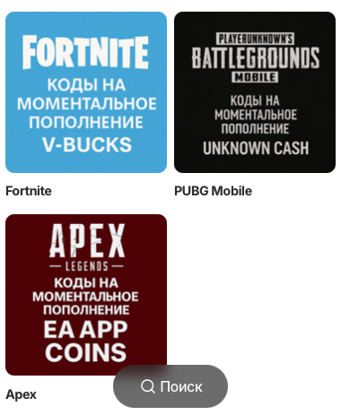
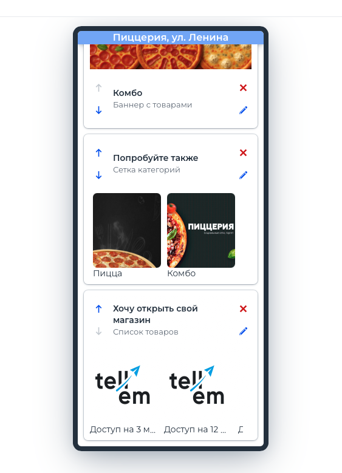

# Оформление главного экрана телеграм-магазина

Данной раздел CRM доступен в пункте меню "Оформление". На данном экране Вы можете управлять внешним видом и наполнением
главного экрана вашего телеграм-магназина. Вы можете создавать различные визуальные компоненты, наполнять их
контентом (товарами, категориями, акциями) и сразу видеть результат в области превью.

## Общие принципы работы

1. **Выбор магазина**: Если у вас несколько торговых точек, выберите нужную в выпадающем списке. Настройки применяются к
   выбранной торговой точке.

2. **Области настройки**:
    - **Верхний Скроллер (Баннеры)**: Горизонтальная лента крупных баннеров в самом верху экрана.
    - **Основные компоненты**: Список блоков (списки товаров, категории, баннеры), идущих друг за другом ниже основного
      скроллера.

3. **Превью**: В правой части экрана отображается актуальный вид. Любые изменения мгновенно отражаются в превью,
   позволяя оценить результат без публикации.

4. **Управление порядком**: С помощью кнопок-стрелок на карточках компонентов можно перемещать блоки выше или ниже.

---

## Типы компонентов и их особенности

Все компоненты разделены на три основные группы:

### 1. Верхний Скроллер (Баннеры)

Элементы, которые всегда находятся в «шапке» главного экрана и прокручиваются горизонтально.

* **Баннер товара**: Позволяет привязать конкретные товары к рекламному изображению.
* **Баннер категории**: Привязывает баннер к выбранным категориям меню.
* **Баннер акции**: Позволяет выбрать активную акцию. При клике покупатель увидит товары, участвующие в акции.
* **Особенность**: Для всех элементов скроллера **обязательно** наличие качественного изображения (фото), которое станет
  фоном.

### 2. Списки и Сетки

Позволяют вывести подборки товаров или категорий прямо в ленту главного экрана.

* **Список товаров (Горизонтальный)**: Прокручиваемая лента карточек товаров. Подходит для блоков типа «Хиты продаж» или
  «Новинки».
* **Сетка товаров (Вертикальная)**: Отображение товаров в несколько колонок. Идеально для акцента на большой группе
  товаров.
* **Список категорий (Горизонтальный)**: Компактные иконки категорий с горизонтальной прокруткой.

* **Сетка категорий (Вертикальная)**: Наглядное отображение разделов меню в несколько рядов.

#### Пример горизонтального списка

#### Пример вертикальной сетки

### 3. Индивидуальные Баннеры в ленте

В отличие от верхнего скроллера, эти баннеры вставляются между списками товаров, позволяя визуально разделять контент.

* **Баннер-ссылка на товары**: Крупное изображение, ведущее на выбранную подборку товаров.
* **Баннер-ссылка на категории**: Изображение, открывающее выбранные категории.

#### Пример баннера

---

## Как добавить новый элемент

1. Нажмите кнопку добавления нужного типа (например, `+ Сетка товаров` или `+ Баннер акции`).
   

2. В открывшемся окне заполните поля:

* **Название**: Заголовок блока для пользователя (например, «Рекомендуем попробовать»). Поддерживает локализацию.
* **Изображение**: Загрузите фото (обязательно для баннеров).
* **Контент**: Выберите товары, категории или акцию.
* **Зоны видимости**: Укажите магазины, в которых этот блок должен отображаться.

3. Нажмите **Сохранить**. Компонент появится в списке и в окне превью.

## Редактирование и удаление

* **Редактирование**: Иконка карандаша на карточке компонента.
* **Сортировка**: Стрелки «Вверх» и «Вниз» для изменения позиции блока.
* **Удаление**: Иконка корзины.
  > **Важно**: Удаление компонента с главного экрана не удаляет сами товары или категории из базы данных системы.

