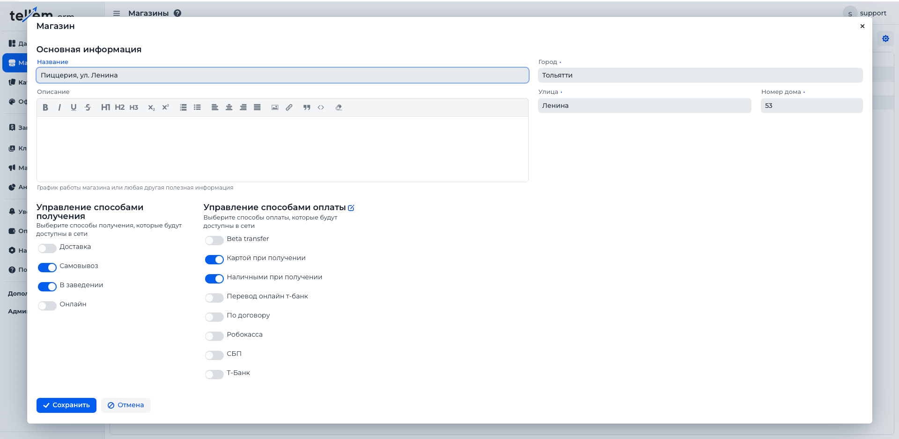

# Настройка способов оплаты

## Создание нового способа оплаты

В меню **Оплата** необходимо:

1. Нажать **Новый сервис** и выбрать поддерживаемый способ.

2. **Заполнить необходимые параметры:**
    - **Наименование** – любое, отображается для покупателя.
    - **Учетные данные** - может быть логин, пароль, секретный ключ или токен.
    - **Комиссия** – наценка за использование способа оплаты, при необходимости добавляется к цене. По умолчанию `0%`.
    - **Время ожидания платежа (в минутах)** - через сколько минут считать платёж неуспешным и отменять заказ
      

    - На второй вкладке экрана настроек существует возможность выбрать **дополнительыне поля для заполнения**, которые
      клиент должен заполнить при оформлении заказа.
      

3. **Активировать новый способ оплаты для существующего магазина.**

   После сохранения способа оплаты система предложит сделать его активным – необходимо подтвердить.

   Если активация не была выполнена в данном окне, активировать способ оплаты можно через:  
   **Магазины → Редактировать существующий магазин → Управление способами оплаты**.

Если какой-либо из способов оплаты отключен в магазине, клиенты не смогут выбрать его внутри телеграм-магазина.
Таким способом можно временно отключать приём заказов от клиентов.