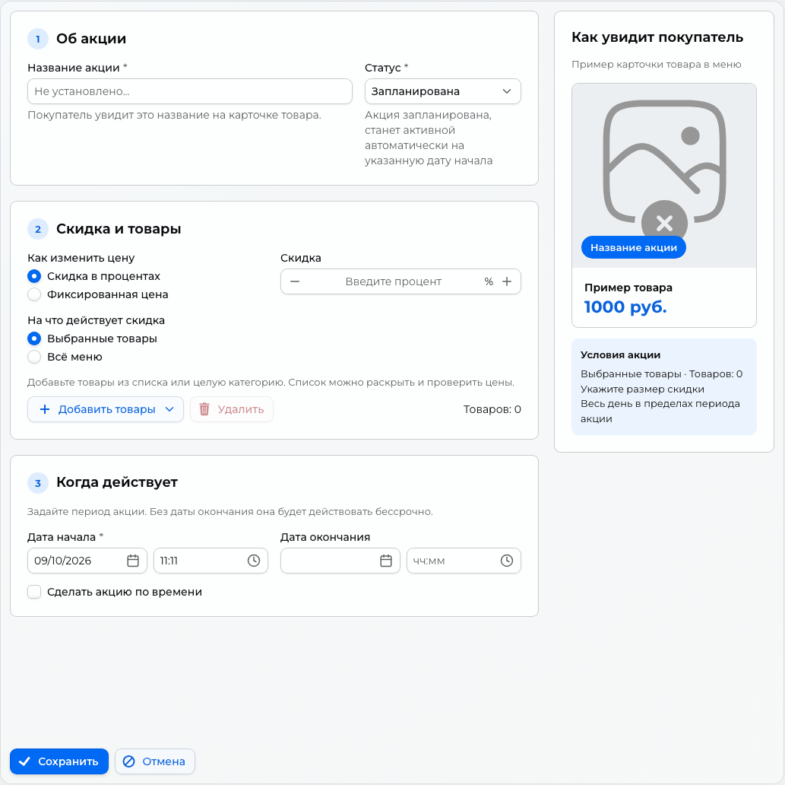

# Акции и промокоды

Акционную цену видят все покупатели, цену по промокоду — покупатель, который ввёл код при оформлении заказа.

Где: **«Маркетинг → Акции»** и **«Маркетинг → Промокоды»**.

## Акции

Акция — это скидка на выбранные товары или всё меню, действующая в заданный период. Покупатель видит акционную цену в каталоге и карточке товара, а вы управляете акциями на экране «Маркетинг → Акции».

### Что можно настроить

| Сценарий | Товары | Цена и время |
| --- | --- | --- |
| Утренний кофе | Товары из категории кофе | −30%, каждый день 08:15–12:00 |
| Вечерняя распродажа десертов | Товары из категории десертов | −30%, с 20:00 до конца дня |
| Обеденные часы | Всё меню | −20%, каждый день 12:00–16:00 |
| Специальная цена | Отдельные варианты товара | Например, 199 руб. весь день |
| Ночная акция | Выбранные товары | Например, −15% с 20:00 до 02:00 следующего дня |
| Акция на выходные | Всё меню или выбранные товары | Общий период с субботы 00:00 до понедельника 00:00, без ежедневных ограничений |

### Список акций

В списке четыре колонки: «Статус», «Наименование», «Дата начала» и «Дата окончания». Кнопка «Создать» открывает форму новой акции, «Редактировать» — выбранную.

### Создание акции

Форма разделена на три блока: **«Об акции»**, **«Скидка и товары»** и **«Когда действует»**. Рядом показана карточка выбранного в таблице или первого добавленного товара: его название, фото и цена после скидки. Фото вписано в квадрат без обрезки, название акции показано на бейдже. Пока товары не добавлены, используются стандартная заглушка и обычная цена 1000 руб. На телефоне блоки расположены одной колонкой.

1. Откройте **«Маркетинг → Акции»** и нажмите **«Создать»**.
2. В блоке **«Об акции»** укажите название, которое увидит покупатель. Для автоматического начала оставьте статус **«Запланирована»**.
3. В блоке **«Скидка и товары»** задайте процент или фиксированную цену. Добавьте конкретные товары либо выберите **«Всё меню»**.
4. В блоке **«Когда действует»** укажите даты начала и окончания. Без даты окончания акция действует бессрочно.
5. Если скидка нужна только в определённые часы, включите **«Сделать акцию по времени»** и заполните **«С»** и **«До»**. Для акции на весь день оставьте настройку выключенной.
6. Проверьте карточку товара и условия под превью, затем нажмите **«Сохранить»**.

На GIF ниже — настройка **«Обеденных часов»**: скидка 20% на всё меню с 12:00 до 16:00. После проверки условий сохраните акцию.

[Открыть GIF в полном размере](../../media/crm/scheduled-sale-creation.gif).

#### Примеры создания

##### Кофе −30% с 08:15 до 12:00

1. Назовите акцию **«Утренний кофе»**.
2. Выберите **«Скидка в процентах»**, в поле **«Скидка»** введите **30**.
3. Оставьте **«Выбранные товары»** и нажмите **«Добавить товары → Из категории»**. Выберите категорию с кофе. Если скидка нужна только на отдельные напитки, используйте **«Добавить товары → Выбрать из списка»**.
4. Включите **«Сделать акцию по времени»**: **«С» — 08:15**, **«До» — 12:00**.
5. Проверьте превью и сохраните. Например, кофе за 290 руб. будет стоить 203 руб.

Скидка повторяется ежедневно в пределах выбранных дат. В 12:00 она уже не применяется.

##### Десерты −30% после 20:00

1. Назовите акцию **«Вечерняя скидка на десерты»** и укажите процент **30**.
2. В режиме **«Выбранные товары»** добавьте категорию с десертами. Раскройте список и удалите товары, которые не должны участвовать.
3. Включите **«Сделать акцию по времени»**, укажите **«С» — 20:00**, а **«До»** оставьте пустым.
4. Проверьте условие **«Каждый день с 20:00 до конца дня»** под превью и сохраните.

Акция заканчивается в полночь и снова начинается в 20:00 следующего дня, пока не истечёт общий период.

##### Всё меню −20% с 12:00 до 16:00

1. Назовите акцию **«Обеденные часы»**.
2. Выберите **«Всё меню»** и в поле **«Скидка»** введите **20**. Добавлять товары не нужно.
3. Включите **«Сделать акцию по времени»**: **«С» — 12:00**, **«До» — 16:00**.
4. Проверьте условия под превью и сохраните. Товар за 500 руб. будет стоить 400 руб.

Скидка охватывает всё меню, включая товары, добавленные после создания акции. Без выбранного товара превью использует пример за 1000 руб. и показывает 800 руб.; реальные цены рассчитываются для каждого товара отдельно.

##### Фиксированная цена на отдельные товары

1. Укажите название, например **«Специальная цена»**.
2. Выберите **«Фиксированная цена»** и в поле **«Цена по акции»** введите **199**.
3. В режиме **«Выбранные товары»** добавьте нужные варианты из списка. Все они получат цену 199 руб. Если цены должны различаться, измените их кнопкой-карандашом в каждой строке.
4. Задайте общий период. Для акции на весь день оставьте **«Сделать акцию по времени»** выключенным, затем сохраните.

Фиксированная цена доступна для выбранных товаров. Для всего меню используется процентная скидка.

#### Основные поля

- **«Название акции»** — название на бейдже карточки товара, до 100 символов. Обязательное поле. Если в «Настройки → Основные» включён мультиязычный режим, название задаётся для каждого языка магазина.
- **«Статус»** — «Активна», «Запланирована» или «Завершена». Под полем выводится подсказка о выбранном статусе:
    - «Активна» — скидки доступны в заданные даты и часы;
    - «Запланирована» — акция станет активной автоматически в дату начала;
    - «Завершена» — клиенты не видят предложенные скидки.
- **«Дата начала»** и **«Дата окончания»** — общий период действия. Оставьте «Дату окончания» пустой, чтобы акция действовала бессрочно.

!!! note "Статус меняется автоматически"
    Систему не нужно вручную переключать в день старта или окончания: раз в минуту CRM проверяет сроки и сама переводит запланированные акции в «Активна», а акции с истёкшей датой окончания — в «Завершена».

    Ежедневные часы не меняют статус: акция может оставаться активной, а скидка применяется только в её временном интервале.

#### Ежедневное расписание

Включите **«Сделать акцию по времени»**, чтобы показать поля **«С»** и **«До»**. Расписание повторяется каждый день в пределах общего периода акции. В остальное время действуют обычные цены.

- **Обычный интервал:** 08:15–12:00 — скидка начинается в 08:15 и перестаёт действовать в 12:00.
- **До конца дня:** начало 20:00, окончание пустое — скидка действует с 20:00 до полуночи.
- **Через полночь:** 20:00–02:00 — скидка действует вечером и заканчивается в 02:00 следующего дня. Начало и окончание не должны совпадать.

Готовое расписание показано под превью. Время учитывается в часовом поясе пользователя, сохранённом при включении расписания. Общие даты ограничивают и ночную акцию: она не продолжится после указанной даты и времени окончания.

Если расписание не нужно, оставьте «Сделать акцию по времени» выключенным: поля времени будут скрыты.

#### Тип изменения цены

Переключатель задаёт способ расчёта акционной цены и действует на все товары акции сразу:

- **«Скидка в процентах»** — укажите процент в поле «Скидка» (от 1 до 99). Акционная цена считается от цены товара, в таблице появляется колонка «Цена по акции». Для всего меню доступна процентная скидка; переключатель типа цены скрыт.
- **«Фиксированная цена»** — укажите новую цену в поле «Цена по акции» (не меньше 1). В таблице появляется колонка «Фиксированная цена», её можно править для каждого товара отдельно кнопкой-карандашом в строке. Повторное открытие акции сохраняет индивидуальные цены.

!!! warning "Индивидуальная цена только для фиксированного типа"
    Пока выбрано «Скидка в процентах», отдельную цену для строки задать нельзя — CRM покажет сообщение «Указание фиксированной цены не доступно, пока выбрано изменение цены на процент». Переключитесь на «Фиксированная цена», если цены должны различаться по товарам.

#### Товары акции

Кнопка «Добавить товары» предлагает два способа наполнения:

- **«Выбрать из списка»** — выбор конкретных вариантов товара;
- **«Из категории»** — добавление всех товаров выбранной категории.

Раскройте **«Выбрано товаров: N»**, чтобы посмотреть таблицу с колонками «Категория», «Вариант товара», «Цена продажи» и рассчитанной акционной ценой. При выборе фиксированной цены таблица открывается автоматически. Кнопка удаления убирает выбранные строки из акции (сами товары в каталоге остаются).

При смене процента или фиксированной цены акционные цены в таблице пересчитываются сразу — результат виден до сохранения. Добавление из категории включает её текущие товары; новые товары автоматически включаются только при выборе всего меню.

#### Сохранение

Кнопка «Сохранить» сохраняет акцию, «Отмена» — выходит без сохранения. Активная акция действует в пределах общего периода и заданных часов. При пересечении нескольких акций выбирается самая низкая цена; проценты не складываются.

Например, товар за 500 руб. участвует в двух акциях: −20% даёт цену 400 руб., −30% — 350 руб. Во время пересечения покупатель получит цену **350 руб.**

Чтобы закончить акцию раньше, откройте её, выберите статус **«Завершена»** и сохраните. Для изменения скидки, товаров или расписания отредактируйте существующую акцию.

### Как акция выглядит у покупателя

- В каталоге и карточке товара отображается акционная цена.
- Акцию можно вынести на главный экран приложения отдельным блоком: в «Каталог → Оформление» добавьте компонент «Верхний баннер с акцией» и выберите акцию в поле «Акция». Нажав на баннер, покупатель увидит товары, участвующие в акции. Подробнее — [Оформление главного экрана клиентского приложения](main-page.md).

## Промокоды

### Создание промокода

Кнопки в списках — «Создать» и «Изменить». Удалить акцию или промокод нельзя: чтобы прекратить действие, поставьте статус «Завершена». «Сохранить» в форме сохраняет, «Отмена» закрывает без сохранения.

| Поле | Как работает |
|---|---|
| «Наименование» | Обязательное поле. Если в [«Настройки → Основные»](general-settings.md) включён «Мультиязычный редактор», вводится для каждого языка |
| «Статус» | «Запланирована», «Активна», «Завершена». Раз в минуту CRM сама переводит «Запланирована» в «Активна» по «Дате начала», а «Активна» и «Запланирована» — в «Завершена» по «Дате окончания». Статус можно изменить вручную |
| «Дата начала» | У новой записи — текущий момент, статус «Запланирована»: она станет активной в течение минуты |
| «Дата окончания» | Пусто — бессрочно |

«Тип изменения цены» действует на все товары записи:

- «Скидка в процентах» — от 1 до 99 в поле «Скидка». Цена считается от «Цены продажи» и следует за ней, если вы её поменяете. Цену отдельной строки при проценте задать нельзя.
- «Фиксированная цена» — в поле «Цена по акции» от 1; она не следует за «Ценой продажи». Цену отдельного товара правят в строке таблицы (колонка «Фиксированная цена», кнопка «Изменить»). Новое значение в общем поле перезапишет цены во всех строках.

«Добавить товары» — «Выбрать из списка» (варианты товаров) или «Из категории» (все товары категории). Лишние строки удаляет кнопка «Удалить». Форма не сохранится, если нет ни одного товара, окончание раньше начала, не закрыто редактирование строки или у товара при фиксированной цене не заполнена цена.

!!! warning "Цена должна быть ниже обычной"
    Скидка действует, только если новая цена ниже «Цены продажи» товара. Если она выше, цена товара в заказе не изменится.

### Код и ограничения

Где: **Маркетинг → Промокоды**. Дополнительно задаются три поля:

- «Код» — обязателен, уникален и чувствителен к регистру. Повтор покажет «Промокод с данным кодом уже существует»;
- «Общее число использований» — лимит на всех покупателей, пусто — без лимита;
- «Число использований клиентом» — лимит на одного покупателя, по умолчанию 1, пусто — без лимита.

В списке две похожие колонки: «Общее число использований» — заданный вами лимит, «Число использований клиентами» — сколько раз код уже применили.

Использование засчитывается при создании заказа и при его отмене не возвращается. Когда общий лимит исчерпан, промокод сам становится «Завершена». В заказе с промокодом есть блок «Промокод» — ссылка на карточку промокода.

Покупатель вводит код при оформлении заказа, там же сообщения об ошибках — [«Оформление и заказы»](../app/checkout.md).

!!! note "Акции и промокоды не суммируются"
    Если покупатель применил промокод, товары из промокода продаются по его цене, а остальные товары заказа — по обычной: акционные цены в этом заказе не действуют. Без промокода заказ считается по акционным ценам.
