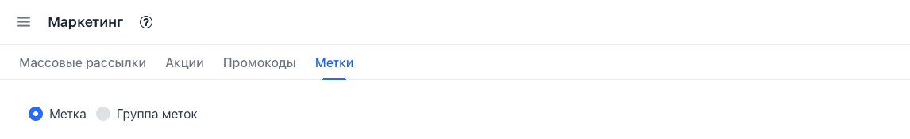
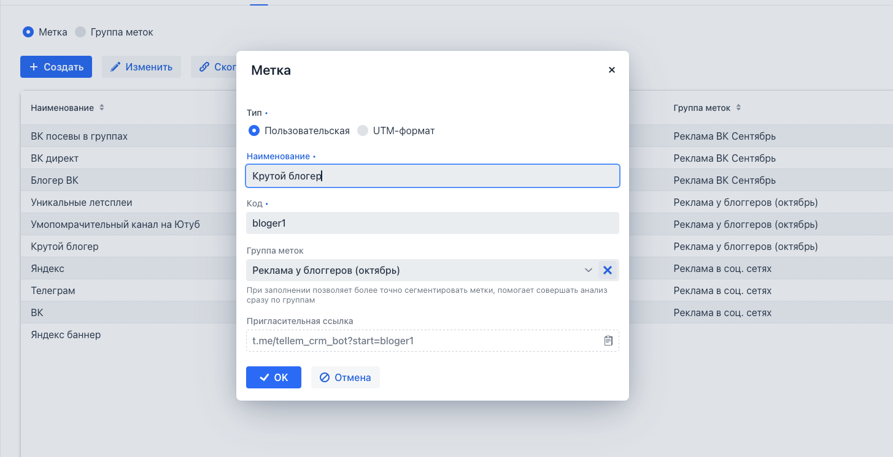
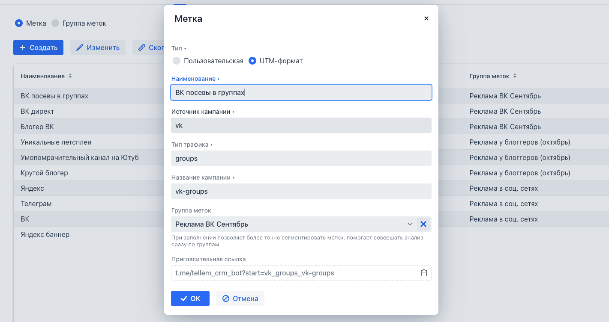
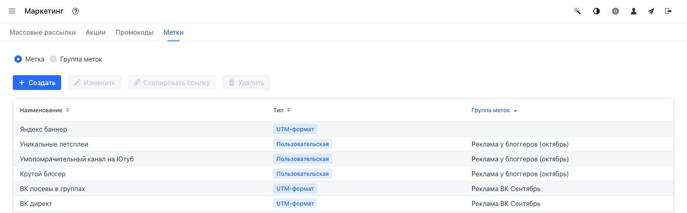
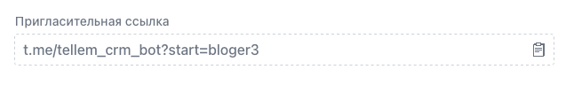
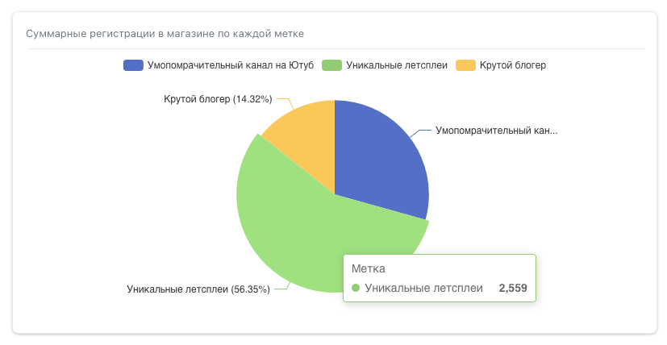
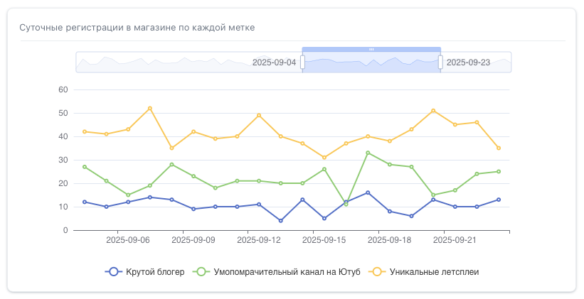
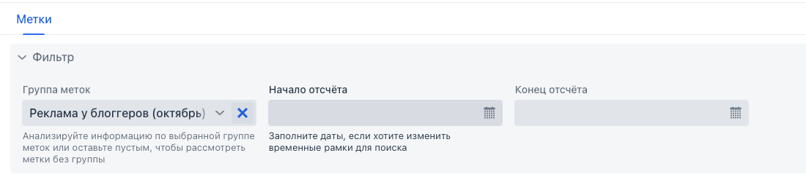

# Работа с пригласительными ссылками (UTM-метками)

Функционал создания меток доступен на вкладке **«Метки»** экрана **«Маркетинг»**.

На экране имеется возможность создавать 2 объекта:

1. **Метка** – объект, который имеет название и блок параметров, формирующих пригласительную ссылку.
2. **Группа меток** – объект, объединяющий несколько меток в одну группу. Может быть полезно, если требуется
   анализировать рекламные кампании сразу по группам меток. Не формирует пригласительные ссылки, служит исключительно
   для объединения существующих меток в группу.

---

## Создание метки

Создавая метку, можно выбрать один из двух способов формирования:

- **Пользовательская метка** – при создании необходимо указать только уникальный **код**, который однозначно будет
  определять метку.
  
- **Метка в формате UTM** – при создании потребуется указать:
    - источник кампании (`utm_source`);
    - тип трафика (`utm_medium`);
    - название кампании (`utm_campaign`).
      
      В обоих случаях указание группы меток является необязательным.

---

## Пример использования

Для создания рекламной кампании у нескольких блогеров создадим следующие объекты:

1. **Группу меток** с названием *«Реклама у блогеров (октябрь)»*.

   Во-первых, с помощью группы мы сможем отличать метки для нашей рекламной кампании от других ранее созданных меток.  
   Во-вторых, получим на экране аналитики статистику сразу по данной группе без необходимости вручную выбирать
   конкретные метки для показа.

2. **Несколько меток** для каждого блогера, указывая группу меток, созданную на предыдущем шаге.
   
3. Для каждой метки скопируем сформированную ссылку и передадим каждому блогеру.
   
   После перехода по каждой ссылке произойдет регистрация новых клиентов в телеграм-магазине с последующим отображением
   статистики на экране **«Аналитика»**.

---

## Экран аналитики меток

Экран доступен из пункта меню **«Аналитика»** на вкладке **«Метки»**.

На экране представлено 2 графика:

- **Суммарные регистрации в магазине по каждой метке** – отображаются итоговые данные за все время. Удобно сравнивать
  итоговые показатели и успешность каждой метки рекламной кампании.
  
- **Суточные регистрации в магазине по каждой метке** – отображаются данные по уникальным переходам за конкретный день
  для конкретной метки. Удобно сравнивать среднесуточные показатели, а также изучать дни наибольшей активности
  переходов.
  
  Для обоих графиков доступна возможность фильтрации через указание **группы меток** и конкретных периодов времени – *
  *начало отсчета** и **конец отсчета**.
  